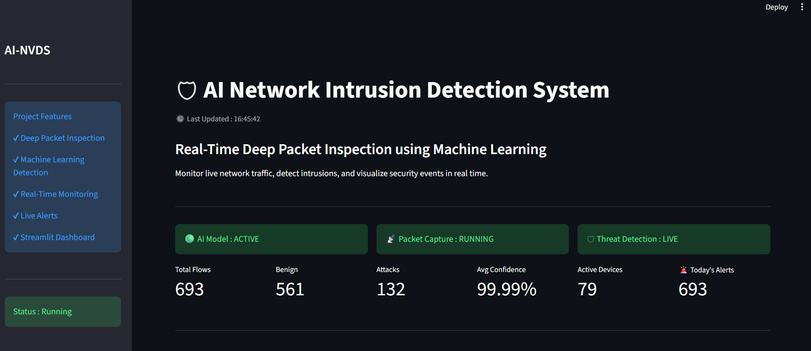
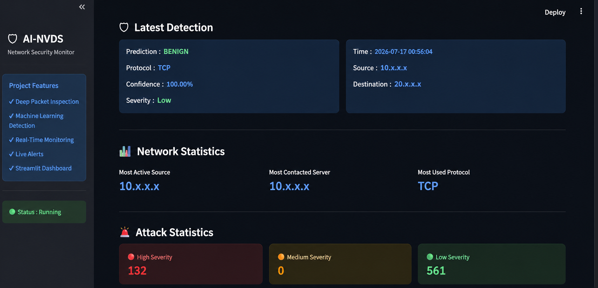

## 🛡️ AI Network Intrusion Detection System

An AI-powered Network Intrusion Detection System (AI-NVDS) designed to monitor network traffic, analyze flow-level features, detect suspicious activity, and visualize security events through a real-time Streamlit dashboard.

The system combines packet capture, flow management, feature extraction, machine learning, rule-based detection, alert logging, and real-time visualization into an end-to-end network security pipeline.

## 📌 Project Overview

Traditional network monitoring systems can generate large amounts of traffic data that are difficult to analyze manually.

This project aims to build a practical intrusion detection pipeline that:

Captures network packets using Scapy
Groups packets into network flows
Extracts traffic-level features
Uses a trained XGBoost classifier for traffic classification
Currently classifies real-time traffic into BENIGN and DDoS
Applies rule-based checks for suspicious traffic patterns
Generates and stores security alerts
Displays traffic and security information through a Streamlit dashboard
Includes a SYN Flood traffic-generation script for controlled testing of the detection pipeline.

## 🎯 Objectives
The main objectives of AI-NVDS are:

Monitor network traffic continuously.
Convert raw packets into meaningful flow-level information.
Extract features required by the machine-learning model.
Detect potentially malicious traffic using machine learning.
Add rule-based security checks for suspicious behavior.
Generate structured security alerts.
Provide a dashboard for monitoring network activity and detected threats.

## ✨ Key Features 

📡 Real-time packet capture
🔄 Network flow management
🔍 Network traffic feature extraction
🤖 XGBoost-based machine-learning detection
🛡️ BENIGN vs DDoS classification in the current real-time predictor
📊 Prediction probability support
🚨 Rule-based suspicious traffic detection
📝 Alert logging to CSV
📈 Real-time Streamlit monitoring dashboard
🔄 Automatic dashboard refresh
⚠️ Severity information for detected events
🧪 SYN Flood attack simulation for testing
📊 Network traffic statistics and visualizations

## 📊 Dashboard

### Real-Time Monitoring Dashboard

The dashboard provides real-time visibility into network traffic, detection status, active devices, attack counts, and model confidence.

### Detection & Network Statistics

The detection view displays the latest prediction, protocol, confidence, severity, network statistics, and attack-severity distribution.

## 🏗️ System Architecture
'''
Network Traffic
│
▼
┌─────────────────┐
│ Packet Capture │
│ Scapy │
└────────┬────────┘
│
▼
┌─────────────────┐
│ Flow Management │
│ Flow Manager │
└────────┬────────┘
│
▼
┌─────────────────┐
│Feature Extraction│
│ Network Features│
└────────┬────────┘
│
┌────────┴─────────┐
│ │
▼ ▼
┌────────────────┐ ┌────────────────┐
│ ML Predictor │ │ Rule Detection │
│ XGBoost │ │ Rules Engine │
└───────┬────────┘ └───────┬────────┘
│ │
└─────────┬──────────┘
▼
┌───────────────┐
│ Alert Logger │
│ alerts.csv │
└───────┬───────┘
│
▼
┌────────────────────┐
│ Streamlit Dashboard│
│ Real-Time Monitor │
└────────────────────┘
'''

## 🔄 Detection Workflow

The complete detection pipeline works as follows:

1. Packet Capture

Network packets are captured using Scapy.

The packet-capture module collects information such as source/destination information, protocol information, packet sizes, timestamps, and TCP-related information.

2. Flow Creation

Individual packets are grouped into network flows using flow-management logic.

A flow represents communication between network endpoints over a period of time.

3. Feature Extraction

The system calculates traffic characteristics from each flow.

Examples include:

Packet counts
Byte counts
Packet lengths
Inter-arrival times
Forward/backward traffic statistics
Flow duration
Packets per second
Bytes per second
TCP-related characteristics

These features are transformed into the format expected by the trained machine-learning model.

4. Machine-Learning Prediction

The extracted features are passed to the trained XGBoost model stored in:

models/nids_model.pkl

The current real-time predictor maps the model output to:

0 → BENIGN
1 → DDoS

The predictor also provides class probabilities using predict_proba().

5. Rule-Based Detection

In addition to machine learning, the project contains rule-based checks to identify suspicious traffic patterns.

This provides an additional detection layer instead of relying only on the ML model.

6. Alert Generation

Detected events are converted into structured alerts containing information such as:

Time
Source IP
Destination IP
Protocol
Prediction
Confidence
Severity

Alerts are stored in:

logs/alerts.csv 

7. Dashboard Monitoring

The Streamlit dashboard reads the generated alert information and presents network-security statistics.
The dashboard automatically refreshes every few seconds to provide updated monitoring information.

## 🤖 Machine Learning
# Algorithm

The project uses XGBoost Classifier for network traffic classification.

The current training configuration is:

n_estimators = 100
max_depth = 6
learning_rate = 0.1
Training Pipeline
CICIDS Dataset
↓
Data Cleaning
↓
Replace Infinite Values
↓
Remove Missing Values
↓
Feature / Label Separation
↓
Label Encoding
↓
80/20 Train-Test Split
↓
XGBoost Training
↓
Test Prediction
↓
Accuracy Evaluation
↓
Save Model

The trained model is saved as:

models/nids_model.pkl
Current Evaluation

The training script currently evaluates the model using classification accuracy on an 80/20 train-test split.

Further evaluation using precision, recall, F1-score, and confusion matrix can be added as a future improvement.

## 📊 Dataset
The model training pipeline uses the CICIDS dataset.

The dataset contains network-flow characteristics and a Label column used as the target.

Before training, the data is processed by:

Removing whitespace from column names
Replacing infinite values
Removing missing values
Separating features from labels
Encoding labels
Splitting the data into training and testing sets
Dataset Handling

The original dataset is intentionally not included in the GitHub repository because of its large file size.

Place the dataset locally at:

data/cicids.csv

before running model training.

## 📁 Project Structure
AI-Network-Intrusion-Detection-System/
│
├── attacks/
│ └── syn*flood.py
│
├── data/
│ └── cicids.csv # Local dataset, not included in repository
│
├── logs/ # Generated locally, not included in repository
│ └── alerts.csv
│
├── models/
│ └── nids_model.pkl
│
├── pcaps/ # Local PCAP files, not included
│
├── src/
│ ├── alert.py
│ ├── check_model.py
│ ├── config.py
│ ├── detector.py
│ ├── feature_extractor.py
│ ├── flow.py
│ ├── flow_manager.py
│ ├── logger.py
│ ├── model_features.py
│ ├── packet_capture.py
│ ├── predictor.py
│ ├── replay_pecap.py
│ ├── rules.py
│ ├── show_model_features.py
│ ├── train.py
│ └── test*\*.py
│
├── .gitignore
├── dashboard.py
└── realtime_detector.py

## 🛠️ Technology Stack

Category Technology
Programming Language Python
Packet Capture Scapy
Data Processing Pandas, NumPy
Machine Learning XGBoost, Scikit-learn
Model Serialization Joblib
Dashboard Streamlit
Visualization Plotly
Dashboard Refresh Streamlit Autorefresh
Dataset CICIDS
Version Control Git & GitHub

## ⚙️ Installation

1. Clone the repository
   git clone https://github.com/priyanshi1808-coder/AI-Network-Intrusion-Detection-System.git
   cd AI-Network-Intrusion-Detection-System
2. Create a virtual environment
   python -m venv venv

Activate it on Windows:

venv\Scripts\activate 3. Install required packages
pip install pandas numpy scikit-learn xgboost joblib scapy streamlit plotly streamlit-autorefresh

Windows note: Packet capture with Scapy may require Npcap to be installed on the system.

## ▶️ Running the Dashboard

Start the Streamlit dashboard with:

streamlit run dashboard.py

The application will be available locally at:

http://localhost:8501

The dashboard provides a monitoring interface for network-security events recorded in logs/alerts.csv.

## 📡 Running Real-Time Detection

The real-time detection pipeline can be started using:

python realtime_detector.py

The detector captures network traffic, processes flows, extracts features, applies machine-learning and rule-based detection, and records detection information.

## 🧪 SYN Flood Testing

The project includes a SYN Flood testing script:

attacks/syn_flood.py

This is intended for controlled testing of the detection pipeline in an authorized environment.

Do not run traffic-generation or attack-simulation code against systems or networks without permission.

## 📈 Dashboard

The Streamlit dashboard provides real-time monitoring information including:

Total flows
Benign traffic
Detected attacks
Average prediction confidence
Active source devices
Latest detection
Source and destination information
Protocol information
Severity
Network traffic statistics
Security recommendations

The dashboard automatically refreshes to display updated alert information.

## 🚨 Alert Monitoring

Detection results are stored in:

logs/alerts.csv

The dashboard reads this information and converts it into visual security-monitoring metrics.

This separates the detection pipeline from the visualization layer:

Detection Pipeline
↓
alerts.csv
↓
Streamlit Dashboard

## 🔐 Security Recommendations

When suspicious traffic is detected, the dashboard can provide recommendations such as:

Investigate suspicious source IP addresses
Review firewall and IDS logs
Block malicious connections where appropriate
Analyze suspicious packets using Wireshark
Monitor repeated traffic patterns

## 📌 Project Status

Current Status: Working Prototype

The project currently includes:

Packet capture
Flow management
Feature extraction
Machine-learning prediction
Rule-based detection
Alert logging
Real-time monitoring dashboard
SYN Flood testing capability

## 👩‍💻 Author

Priyanshi Pandey

B.Tech — Artificial Intelligence & Machine Learning

GitHub: priyanshi1808-coder

## ⭐ If you find this project useful

Feel free to explore the repository, review the implementation, and use it as a reference for learning about machine-learning-based network intrusion detection systems.
